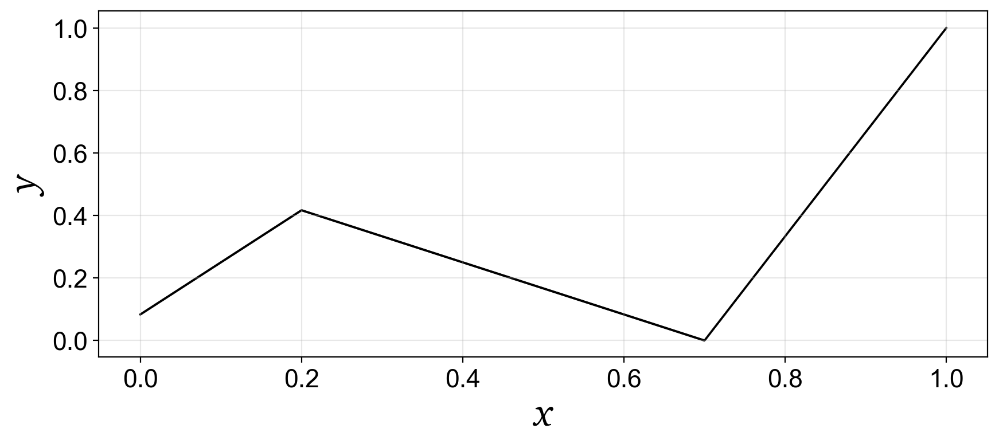
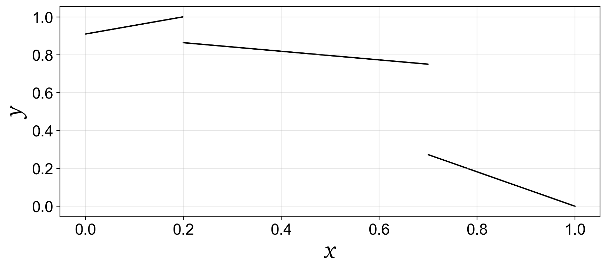
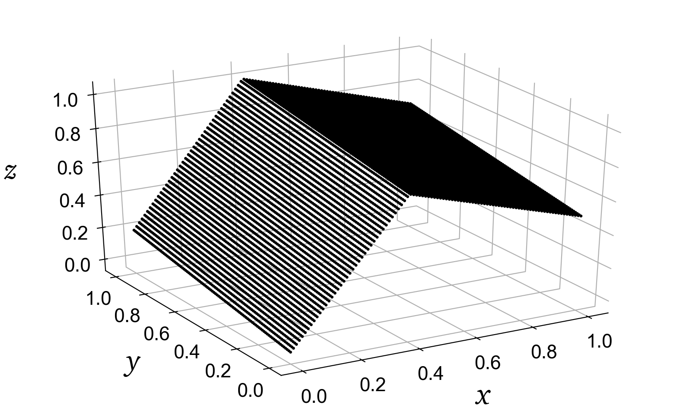
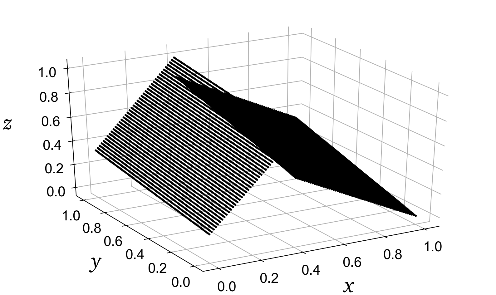
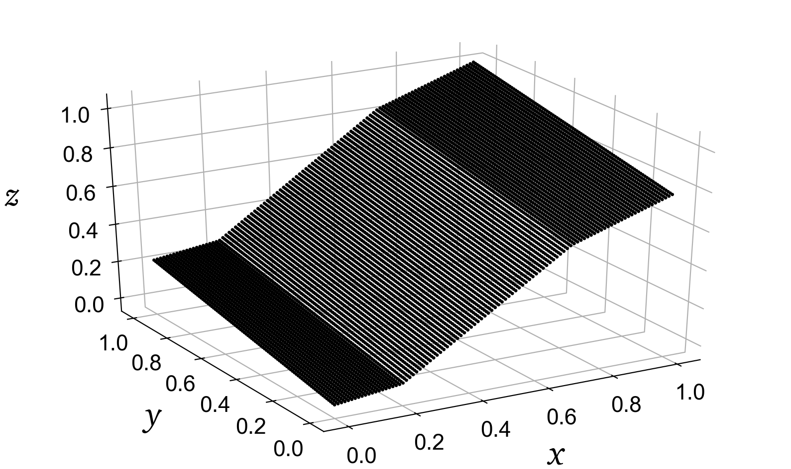
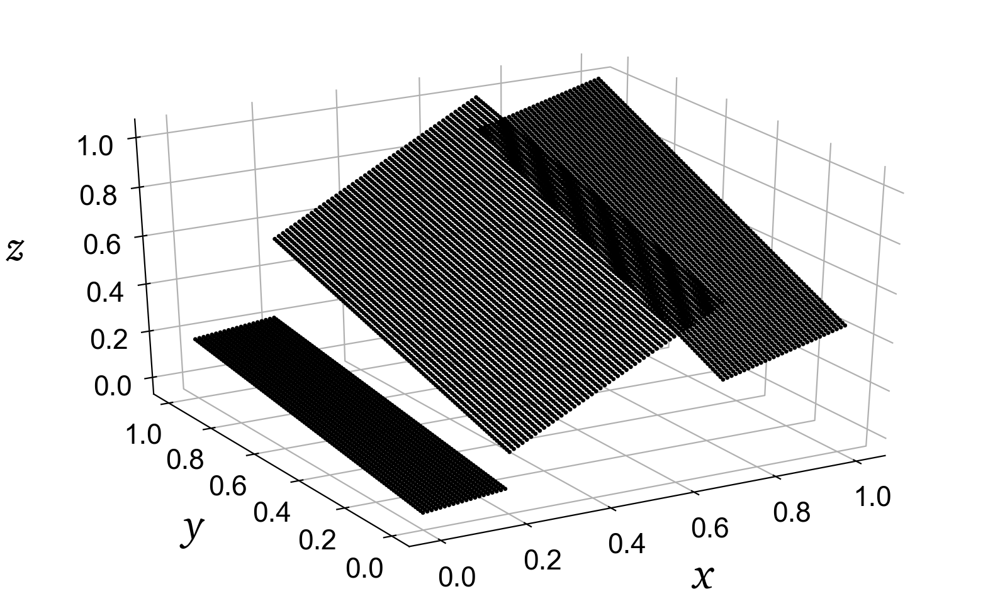
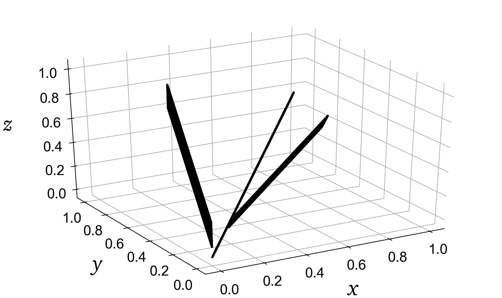

# Data sets composed of hyperplanes

This is a collection of data sets that are composed of manifolds of dimensionality one less than the data dimensionality.

## 2D data sets

This [**Jupyter notebook**](hyperplanes-2D-data-sets.ipynb) can be used to generate various 1D manifolds embedded in a 2D space.

### Three lines, connected

[`hyperplanes-2D-data-sets-three-lines-connected.csv`](hyperplanes-2D-data-sets-three-lines-connected.csv)

### Three lines, disconnected

[`hyperplanes-2D-data-sets-three-lines-disconnected.csv`](hyperplanes-2D-data-sets-three-lines-disconnected.csv)

## 3D data sets

This [**Jupyter notebook**](hyperplanes-3D-data-sets.ipynb) can be used to generate various 2D manifolds embedded in a 3D space.

### Two planes, connected

[`hyperplanes-3D-data-sets-two-planes-connected.csv`](hyperplanes-3D-data-sets-two-planes-connected.csv)

### Two planes, disconnected

[`hyperplanes-3D-data-sets-two-planes-disconnected.csv`](hyperplanes-3D-data-sets-two-planes-disconnected.csv)

### Three planes, connected

[`hyperplanes-3D-data-sets-three-planes-connected.csv`](hyperplanes-3D-data-sets-three-planes-connected.csv)

### Three planes, disconnected

[`hyperplanes-3D-data-sets-three-planes-disconnected.csv`](hyperplanes-3D-data-sets-three-planes-disconnected.csv)

### Three planes in the dependent variable space

This data set is generated as three dependent variables built on the independent variables grid.

[`hyperplanes-3D-data-sets-three-planes-dependent.csv`](hyperplanes-3D-data-sets-three-planes-dependent.csv)

